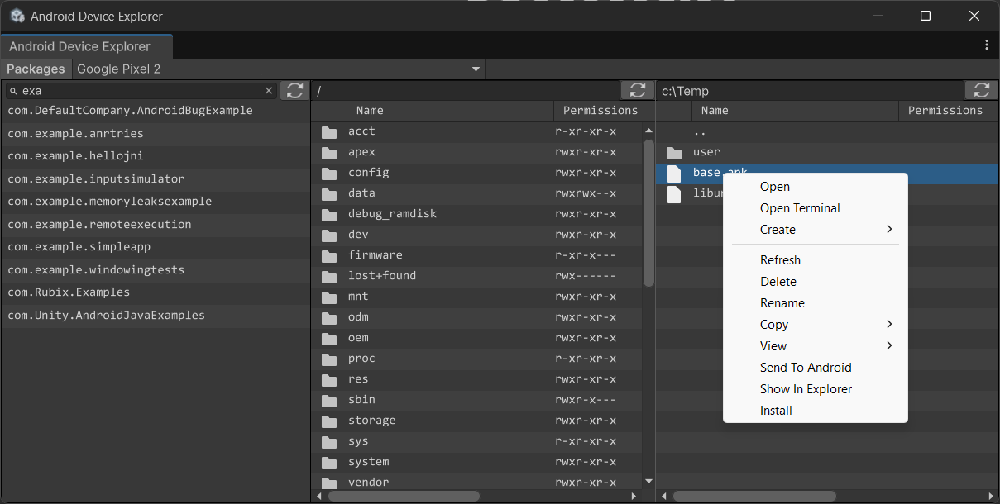
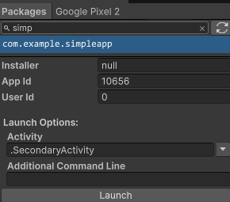
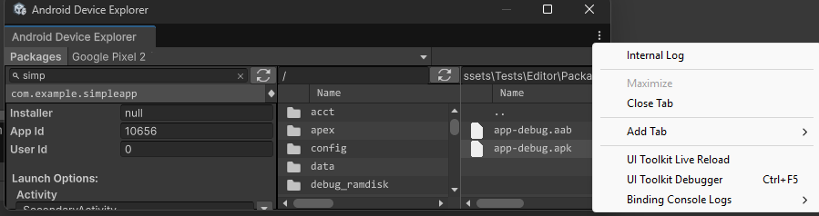

# Rubix Android Device Explorer for Unity

A Unity package for exploring the Android file system and transferring files between your computer and a connected device.



## Requirements

* [Git](https://git-scm.com/install/)
* Unity **6000.0.0f1** or higher  
* Unity Android Build Support

## Installation

1. In Unity, open **Window → Package Manager**.  
2. In the top-left corner, click the **+** button and select **Install package from Git URL**.  
3. Enter the following URL:

   ```
   git@github.com:Rubix1991/com.rubix.unity.android.device-explorer.git
   ```

## Quick Start

1. Connect your Android device via USB and enable **USB debugging**.  
2. Open the Device Explorer window: **Window → Analysis → Android Device Explorer**.  
3. The explorer automatically connects to the first available device.  
4. You can also manually select a device from the dropdown in the top-left corner.  
5. There are three main views:
   * **Packages View** (when the *Packages* toggle is enabled)
   * **Android View** — browse the Android file system
   * **Desktop View** — browse your local computer file system

## Android and Desktop Views

* The **Android view** (left side) displays the file system of the connected Android device.  
* The **Desktop view** (right side) displays the file system of your computer.  
* You can quickly navigate by pasting a path into the address bar.  
* Right-click any item in either view to open a context menu with various options:

| Name | Description |
|:----------|:-------------|
| **Open** | Opens a directory or, if it’s a file, opens it with the default associated application. |
| **Open Terminal (Android view)** | Opens an ADB shell in the current directory. |
| **Open Terminal (Desktop view)** | Opens a terminal in the current directory. |
| **Create → File** | Creates an empty file in the current directory. |
| **Create → Directory** | Creates a new directory in the current directory. |
| **Refresh** | Refreshes the current directory — useful when files have changed since the last query (e.g., a new app was installed). |
| **Delete** | Deletes the selected file(s) or directory(ies). You can also press the **Delete** key. |
| **Rename** | Renames the selected file or directory. |
| **Copy → Name** | Copies the selected file(s) or directory name(s) to the clipboard (Ctrl/Cmd + C). |
| **Copy → Absolute Path** | Copies the absolute path(s) of the selected file(s) or directory(ies) to the clipboard. |
| **View → Manifest** | When an `.apk` or `.aab` file is selected, extracts `AndroidManifest.xml` and opens it in the default associated application.<br>If the file is on the Android device, it’s first pulled to the PC. |
| **View → Signing Information** | Displays signing information for the selected `.apk` or `.aab` file. |
| **Send To PC (Android view)** | Transfers the selected file(s) or directory(ies) from the Android device to your PC. |
| **Send To Android (Desktop view)** | Transfers the selected file(s) or directory(ies) from your PC to the Android device. |
| **Show in Explorer (Desktop view)** | Opens the current directory in the system file explorer. |
| **Install (Desktop view)** | Installs the selected `.apk` or `.aab` file on the Android device. |

### App Bundle (AAB) Options

When right-clicking an `.aab` file in the **Desktop view**, additional options appear.  
These operations use [bundletool](https://developer.android.com/tools/bundletool):

| Name | Description |
|:----------|:-------------|
| **App Bundle → Validate** | Displays validation results for the selected `.aab` file. |
| **App Bundle → Dump → Config** | Shows information about configuration splits — which device configurations (ABI, screen density, locale, SDK version, etc.) the bundle supports and how they’re structured. |
| **App Bundle → Dump → Resources** | Displays information about resources (layouts, drawables, strings, etc.) and how they’re split or targeted (e.g., by density, language, or region). |
| **App Bundle → Dump → Runtime Enabled SDK Config** | Shows details about runtime-enabled SDKs — SDKs that can be updated independently on users’ devices via Google Play’s SDK Runtime system. |

## Packages View



The **Packages View** becomes visible when the **Packages** toggle is enabled in the toolbar.  

You can filter packages by typing the package name in the search field.  
Right-clicking any package opens a context menu with these options:

| Name | Description |
|:----------|:-------------|
| **View Manifest** | Pulls the package APK from the Android device to the PC, extracts `AndroidManifest.xml`, and opens it in the default application. |
| **View Properties** | Displays package properties in a popup window. |
| **Misc → Produce ANR → With SIGSTOP** | Sends SIGSTOP signal to app, this should force ApplicationNotResponding after 5 seconds, if succeeded a file in /data/anr folder will be produced.<br>__Note:__ On retail phones it may be impossible to pull this file, it can be pulled only on emulators.. |
| **Misc → Produce Tombstone → With SIGABRT** | Sends SIGABRT signal to app, in process killing the app, this should force creation of a tombstone with all threads in /data/tombstones. <br>__Note:__ Not all phones allow pull tombstones, it works on Android 16, but doesn't work on Android 10. |
| **Misc → Produce Tombstone → With SIGBUS** | Sends SIGBUS signal to app, same as SIGABRT, this signal kills the app and creates a tombstone. |
| **Navigate** | Opens the selected directory (install folder, data folder, cache, etc.). |
| **Uninstall** | Uninstalls the selected package(s) from the Android device. |

When a package is selected, a **Launch UI** appears at the bottom.  
You can specify the activity name and additional command-line arguments to launch the app.  
If the package has multiple activities, use the dropdown on the right to choose the desired one.

## Internal Log

If you want to see which commands are executed in the background, enable the **Internal Log**:  
Click the three dots in the top-right corner and select **Internal Log**.


